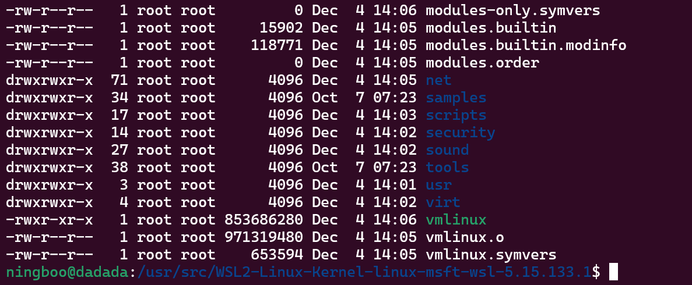

## USB相机连接到wsl并使用opencv读取视频流

### windows侧安装[usbipd-win](https://github.com/dorssel/usbipd-win.git)
- 打开github，下载安装最新`release`版本
- 以管理员方式打开`Terminal/CMD/Powershell`
```powershell
PS C:\Users\ningd> usbipd wsl list
BUSID  VID:PID    DEVICE                                                        STATE
...      ...       ...                                                          Not attached
3-1    2bc5:0511  USB Camera                                                    Not attached
4-2    2bc5:0614  ORBBEC Depth Sensor                                           Not attached

PS C:\Users\ningd> wsl --list
适用于 Linux 的 Windows 子系统分发:
docker-desktop-data (默认)
docker-desktop
Ubuntu-22.04
Ubuntu-18.04
PS C:\Users\ningd> usbipd wsl attach -d Ubuntu-18.04 --busid 3-1  # Ubuntu-18.04需要已经启动

PS C:\Users\ningd> usbipd wsl list
BUSID  VID:PID    DEVICE                                                        STATE
...      ...       ...                                                          Not attached
3-1    2bc5:0511  USB Camera                                                    Attached - WSL
4-2    2bc5:0614  ORBBEC Depth Sensor                                           Not attached
```
### WSL侧
- 安装工具
```shell
ningboo@dadada:~$ sudo apt install linux-tools-generic hwdata
ningboo@dadada:~$ sudo update-alternatives --install /usr/local/bin/usbip usbip /usr/lib/linux-tools/*-generic/usbip 20
ningboo@dadada:~$ lsusb
Bus 002 Device 001: ID 1d6b:0003 Linux Foundation 3.0 root hub
Bus 001 Device 002: ID 0c45:6366 Microdia Webcam Vitade AF
Bus 001 Device 001: ID 1d6b:0002 Linux Foundation 2.0 root hub
ningboo@dadada:~$
```
- 编译带USB驱动的内核
```shell
ningboo@dadada:~$ sudo apt update && sudo apt upgrade -y && sudo apt install -y build-essential flex bison libgtk2.0-dev libelf-dev libncurses-dev autoconf libudev-dev libtool zip unzip v4l-utils libssl-dev python3-pip cmake git iputils-ping net-tools dwarves
ningboo@dadada:~$ sudo mkdir /usr/src && cd /usr/src
ningboo@dadada:~$ uname -a
Linux dadada 5.15.133.1-microsoft-standard-WSL2 #1 SMP Thu Oct 5 21:02:42 UTC 2023 x86_64 x86_64 x86_64 GNU/Linux
ningboo@dadada:~$ VERSION=5.15.133.1
ningboo@dadada:~$ git clone -b linux-msft-wsl-${VERSION} https://github.com/microsoft/WSL2-Linux-Kernel.git ${VERSION}_wsl_kernel && cd ${VERSION}_wsl_kernel
ningboo@dadada:~$ sudo cp /proc/config.gz ./config.gz


ningboo@dadada:~$ sudo gunzip config.gz
ningboo@dadada:~$ sudo mv config .config
ningboo@dadada:~$ sudo make menuconfig
```
接下来配置内核功能：
- 选择 `Device Drivers`

- 选择 `Multiplemedia support` ，按空格，将选项置为`*`

- 选择`Filter media drivers`

    - 选择 `Media device types > Cameras amd vodep grabbers` ，按空格，将选项置为`*`
    
    - 选择 `Video4Linux options > V4L2 sub-device userspace API` ，按空格，将选项置为`*`
    
    - 选择 `Media drivers > Media USB Adapters` ，按空格，将选项置为`*`
    
- 保存配置

```shell
ningboo@dadada:~$ sudo make -j$(nproc)
ningboo@dadada:~$ sudo make modules_install -j$(nproc)
ningboo@dadada:~$ sudo make install -j$(nproc)
ningboo@dadada:~$ ls -al
```
编译结果：

```shell
ningboo@dadada:~$ sudo cp vmlinux /mnt/c/Sources
ningboo@dadada:~$ exit
```
### Windows侧
```powershell
PS C:\Users\ningd> wsl --shutdown
```
在`home(C:\Users\ningd)`目录下创建文件.wslconfig
```config
[wsl2]
kernel=C:\\Sources\\vmlinux
```

### 见证奇迹
- 打开wsl
```shell
ningboo@dadada:~$ ll /dev/video*
ls: cannot access '/dev/video*': No such file or directory
```
- windows侧
```powershell
PS C:\Users\ningd> usbipd wsl list
BUSID  VID:PID    DEVICE                                                        STATE
1-7    0d8c:023c  Cmedia Audio, USB 输入设备                                    Not attached
1-8    8087:0a2a  英特尔(R) 无线 Bluetooth(R)                                   Not attached
1-12   0d8c:023e  Cmedia Audio, USB 输入设备                                    Not attached
3-4    0c45:6366  USB Camera                                                    Not attached
5-1    1532:004f  USB 输入设备                                                  Not attached
5-2    05ac:024f  USB 输入设备                                                  Not attached

PS C:\Users\ningd> usbipd wsl attach --busid 3-4
usbipd: info: Using default WSL distribution 'Ubuntu-22.04'; specify the '--distribution' option to select a different one.
PS C:\Users\ningd>
PS C:\Users\ningd> usbipd wsl list
BUSID  VID:PID    DEVICE                                                        STATE
1-7    0d8c:023c  Cmedia Audio, USB 输入设备                                    Not attached
1-8    8087:0a2a  英特尔(R) 无线 Bluetooth(R)                                   Not attached
1-12   0d8c:023e  Cmedia Audio, USB 输入设备                                    Not attached
3-4    0c45:6366  USB Camera                                                    Attached - WSL
5-1    1532:004f  USB 输入设备                                                  Not attached
5-2    05ac:024f  USB 输入设备                                                  Not attached

PS C:\Users\ningd>
```
- wsl侧
```shell
ningboo@dadada:~$ ll /dev/video*
crw-rw---- 1 root video 81, 0 Dec  4 14:18 /dev/video0
crw-rw---- 1 root video 81, 1 Dec  4 14:18 /dev/video1
crw-rw---- 1 root video 81, 2 Dec  4 14:18 /dev/video2
crw-rw---- 1 root video 81, 3 Dec  4 14:18 /dev/video3
ningboo@dadada:~$
```
- `opencv`测试
```python
#!/usr/bin/env python3
import cv2


cap = cv2.VideoCapture('/dev/video0')
cap.set(cv2.CAP_PROP_FOURCC, cv2.VideoWriter_fourcc('M', 'J', 'P', 'G'))

while cap.isOpened():
    ret, frame = cap.read()
    if not ret:
        continue
    cv2.imshow('USB Camera', frame)
    key = cv2.waitKey(1)
    if key == ord('q') or key == ord('Q'):
        break
cv2.destroyAllWindows()

```
- 打开相机`python camera.py`
